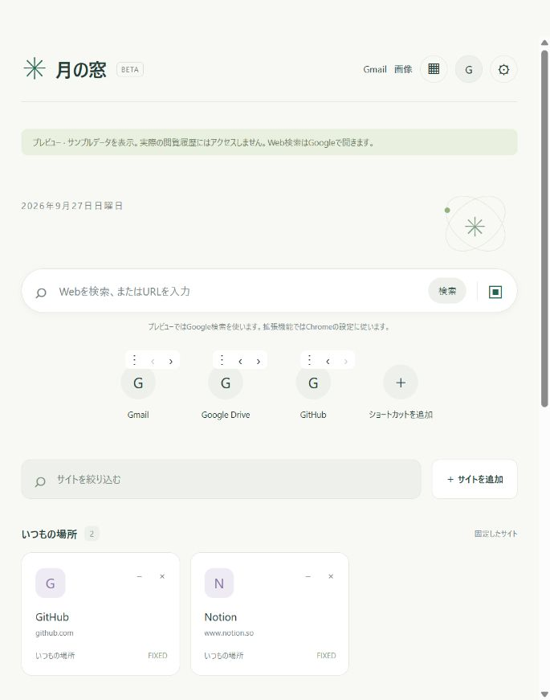

# 月の窓

利用頻度・最近の利用・時間帯をもとに、おすすめサイトを表示するChrome新規タブ拡張です。初版は説明可能な重み付きスコアを使用します。ニューラルネットワークや確率推定はまだ実装していません。

作者: [yun](https://github.com/yunyun777-bit) · [MIT License](LICENSE)

現在はテスター向けの試作版です。0.2.1では起動不具合を修正し、利用者から実Chromeでの新規タブ表示、ショートカット・背景の別タブへの保存、履歴を使ったおすすめの基本動作について確認を得ています。Chrome再起動や権限拒否などの手動確認と、実利用での推薦性能評価は未完了です。詳細は[確認記録](docs/VALIDATION.md)を参照してください。



## Chromeにインストール

1. [リリース一覧](https://github.com/yunyun777-bit/tsuki-no-mado/releases)から最新の `tsuki-no-mado-バージョン.zip` をダウンロードして展開します。ソースのフォルダーをそのまま利用することもできます。
2. Chromeで `chrome://extensions` を開きます。
3. 「デベロッパーモード」を有効にします。
4. 「パッケージ化されていない拡張機能を読み込む」で、`manifest.json` のあるこのフォルダーを選択します。
5. 新しいタブを開きます。Chromeが変更の確認を表示した場合は、内容を確認して維持します。

ビルド・npm install・APIキー・アカウント登録は不要です。他の新規タブ拡張と同時には使えません。シークレットウィンドウには対応しません。

0.2.2ではサイトアイコン表示のために `favicon` 権限が加わります。同じ読み込みフォルダーを更新してChromeの再読み込みボタンを押してください。Chromeから確認が出た場合は内容を確認してください。

## Chrome標準の新規タブとの関係

現在の実装は `chrome_url_overrides.newtab` により、新規タブ全体を月の窓に置き換えます。Chrome標準画面への部分的な追加ではありません。0.2.0では、通常の新規タブでよく使う機能を月の窓内に再実装しています。アドレスバーやブラウザー本体の機能は引き続き使えます。

| 機能 | 月の窓での対応 |
| --- | --- |
| Web検索・URL入力 | Chromeの既定の検索エンジンで検索。HTTP(S)のURLは指定ページへ移動 |
| ショートカット | 最大8グループ、各10件。名前と完全なURLを保存・編集・削除・並べ替え。削除直後は「元に戻す」が利用可能 |
| よくアクセスするサイト | 許可済みの学習履歴から訪問回数順で表示。Chrome内部の一覧とは別 |
| ショートカットの表示切替 | カスタマイズから自分のショートカット／よくアクセスするサイト／非表示を選択 |
| 背景・明暗 | 背景色、ローカル画像（2MB以下）、ライト／ダーク／デバイス連動 |
| Gmail・画像・Googleアプリ・アカウント | 各公式サービスへのリンク。アカウント情報は取得しない |
| Google Lens | 画像検索へのリンク。移動後のカメラアイコンから使用 |

純正の音声検索UI、検索候補の自動補完、Doodle、Googleアカウントに基づくカード、Chromeのテーマギャラリーや背景の毎日更新は再現していません。音声検索はGoogleのページなどから利用してください。既存のChromeショートカット・背景・Googleアプリの並び順を自動インポートするものではありません。

標準機能を完全に保持する場合は、新規タブを置き換えずにサイドパネルへ推薦一覧を表示する構成が必要です。サイドパネルを最初に開くには、拡張ボタンなどのユーザー操作が必要です。

仕様の参照先：[新規タブの置き換え](https://developer.chrome.com/docs/extensions/develop/ui/override-chrome-pages)、[Side Panel API](https://developer.chrome.com/docs/extensions/reference/api/sidePanel)。

## 使い方

- 「ページをカスタマイズ」の背景色で「時間に合わせる」を選ぶと、端末の時刻に応じて朝・昼・夕方・夜の空へ変化します。明るさの「自動」は、この背景では昼夜、それ以外ではデバイス設定に従います。ライト・ダークの指定や自分の背景画像を優先します。
- 更新前の背景色や画像は引き継ぎます。時間連動は手動で選択できます。新規利用時は時間連動が初期設定です。
- 月の形は日付からの近似表示です。約29.53日の平均周期を使い、観測地点からの見え方や厳密な月齢を示すものではありません。計算の参考：[NASAの月の満ち欠け](https://science.nasa.gov/moon/moon-phases/)、[USNOの月相表](https://aa.usno.navy.mil/downloads/Circular_169_coverupdate.pdf)。
- カードにカーソルを乗せると少し浮き、アイコンの周囲が光ります。OSの「動きを減らす」設定では移動・拡大を止めます。
- 時間連動の背景には漂う光・星・流れ星を表示し、月がゆっくり上下します。カードは新規タブの初回表示時だけ順番に現れます。「背景や月を動かす」をオフにすると常時の動きを停止できます。OSの「動きを減らす」設定ではこれらのアニメーションも停止します。

- 画面中央の検索欄でWeb検索、またはURLへの移動ができます。検索エンジンの設定は変更しません。`/` キーでも検索欄に移動できます。
- 「ショートカットを追加」で名前・個別ページのURLを登録できます。「⋮」から編集・削除、「‹」「›」から並べ替えできます。
- ページ下部の「ページをカスタマイズ」から背景・明暗・ショートカット表示を変更できます。Chrome本体のテーマは変更しません。
- 「サイトを追加」で手動登録できます。入力URLはオリジン（例 `https://example.com`）にまとめられ、個別のページや検索結果は登録しません。
- 「履歴を使って始める」を押した場合だけ、Chromeの履歴権限を要求します。
- 初回は直近30日で最大250ページを対象に訪問時刻を読み込みます。全履歴の網羅的な分析ではありません。
- 許可後は訪問を学習し、候補を最大12件表示します。サイト内の10分未満の連続移動をまとめます。
- カード右上の「＋」で最大8件を固定できます。「×」で候補から非表示にして、そのサイトの訪問記録を削除します。
- 「サイトを絞り込む」は推薦候補だけの絞り込みです。Web検索欄とは別です。
- 設定から学習停止・非表示解除・データ削除ができます。停止では既存の推薦データを残し、履歴権限を取り消します。

## 0.4.0で追加した機能（未公開）

- **グループ**：ショートカット欄の「＋ グループ」で作成、「編集」で名前を変更。最大8グループ・各10件。既存のショートカットは「いつもの」へ引き継ぎ、最後に選んだグループを保存します。ショートカットの編集で所属を変更でき、空のグループは削除できます。
- **一時非表示**：おすすめカードの「◷」から「今日中」（端末の翌日0時まで）か「1週間」を選択。訪問記録は残り、学習中は引き続き訪問を記録します。設定から期限前に戻すこともできます。従来の「×」による非表示とは別です。
- **バックアップ**：設定からJSONファイルを保存・読み込み。対象はグループ、ショートカット、固定サイト、外観（背景画像を含む）、一行メモです。閲覧履歴・学習権限・非表示リスト・一時非表示は含めません。読み込み時に内容を検証し、確認後に対象設定を置き換えます。復元する固定サイトの非表示は解除します。置き換え前に現在の設定も保存できます。
- **表示量**：カスタマイズでおすすめを4・8・12件から選択。固定・おすすめの見出しから折りたたみ可能で、状態を保存します。
- **今日やること**：検索欄の下に160文字以内の一行メモを保存。日付が変わっても残り、空欄で保存すると消去できます。カスタマイズから非表示にもできます。

追加の権限・外部通信・ライブラリは不要です。バックアップファイルには登録したURLやメモが含まれるため、共有する場合は内容を確認してください。

## 推薦の仕組み

訪問回数には半減期14日の減衰をかけ、時間帯の近さ（24時間周期）、平日／週末の一致、直近の訪問（半減期3日）を組み合わせます。

`score = 0.9 log(1 + frequency) + 1.4 log(1 + timeAffinity) + 0.35 log(1 + dayTypeAffinity) + 0.8 recency + manualBonus`

各履歴は最長90日、各サイト最大1,200訪問、候補最大300サイトです。サイトの順位は確率ではありません。固定サイトは別枠で順番を維持します。利用者から学習するのは訪問パターンであり、上式の係数は固定です。

今後、単純な頻度順に対する「次の訪問先が上位8件に含まれた割合」を時系列で検証し、直前の行動を扱うモデルや小規模ニューラルネットワークとの比較を検討します。予測精度の向上は未検証です。

## プライバシー

詳細は [PRIVACY.md](PRIVACY.md) を参照してください。学習・保存はこの端末内で完結します。外部AI API、解析SDK、遠隔フォントは使用しません。サイトアイコンはChrome内蔵のfavicon機能から取得し、外部のアイコン取得サービスは使いません。取得エラー時とブラウザープレビューでは頭文字を表示します。Chromeに保存されていないアイコンは標準の代替アイコンになる場合があります。背景での外部通信はCSPでも禁止しています。Web検索を実行すると検索語が設定済みの検索サービスに送られ、リンクを押すとリンク先へ通常の移動を行います。検索語は月の窓に保存しません。

## 開発・検証

別セッションから作業を続ける場合は、[共通の作業指示](AGENTS.md)と[実装の引き継ぎ](docs/HANDOFF.md)を確認してください。未コミットの実装、関連ファイル、検証範囲、Chromeへの反映方法をまとめています。

Node.js 22以上を利用します。外部依存はありません。

```sh
npm run check
npm run preview
npm run package
```

`http://127.0.0.1:4173` はサンプルデータのプレビューです。履歴権限やChromeのバックグラウンド処理は動きません。操作の変更はメモリー内だけで、再読み込みするとリセットされます。プレビューのWeb検索はGoogleに移動します（Chromeの既定の検索エンジンを参照するAPIは拡張機能内だけで利用可能です）。

`check` は拡張設定、実行ファイルの参照、JavaScript構文、自動テストを確認します。`package` は `dist/` に必要な実行ファイルとライセンス・プライバシー説明だけを集めたフォルダーを作ります。利用者はNode.jsなしで、そのフォルダーをChromeに読み込めます。

推薦を単純な頻度順と比較するローカル評価も用意しています。

```sh
npm run evaluate -- --demo
```

上記は合成データでの動作確認です。実利用での精度を示すものではありません。実データの入力方法、分母、制限は [評価方法](docs/EVALUATION.md) を参照してください。

仮称Tabloomから更新する場合は、同じフォルダーを使い、`chrome://extensions` に表示される既存の拡張機能の再読み込みボタンを押してください。再読み込み後の名称は「月の窓」になります。名称変更に伴うデータ移行は不要で、学習データや設定を引き継ぎます。

0.1.0から更新する場合は、既存データを保持したままショートカット・表示設定の初期値を追加します。Web検索のために `search` 権限が加わります。

実拡張の確認項目：初回の空状態、履歴許可／拒否、学習停止・再開、手動追加、固定・解除、非表示、Chrome再起動、Chromeの履歴削除、拡張のデータ削除。自動テストだけではChrome自身の権限UIやService Workerの寿命を保証しません。

## 公開について

[GitHubリポジトリ](https://github.com/yunyun777-bit/tsuki-no-mado) で試作版のソースを公開しています。Chrome Web Storeには公開していません。不具合や導入時の問題は [Issues](https://github.com/yunyun777-bit/tsuki-no-mado/issues) に、個人情報を除いた再現手順を添えて報告してください。

- [貢献・不具合報告](CONTRIBUTING.md)
- [セキュリティ上の問題の報告](SECURITY.md)
- [実際のChromeでの確認手順](docs/TESTING.md)
- [配布・公開手順](docs/RELEASE.md)
- [変更履歴](CHANGELOG.md)

## English

Tsuki no Mado is an experimental Chrome new-tab extension that recommends sites using visit frequency, recency, and time of day. Browsing-history processing stays on the device; history access is optional. It also provides web search using Chrome's default provider, editable shortcuts, and local appearance settings.

The ranking uses a fixed weighted score, not a neural network or calibrated probabilities. Better real-world accuracy than frequency-only ranking has not been established. Automated tests and the sample-data preview have been checked; the full Chrome permission and restart checklist remains pending. See [PRIVACY.md](PRIVACY.md) for data handling and [LICENSE](LICENSE) for the MIT terms.
